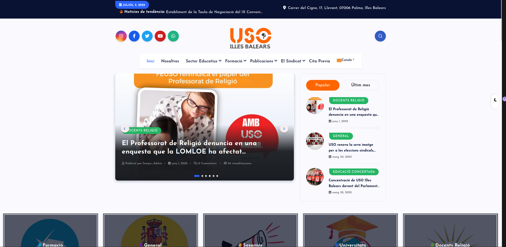

# Descripción del proyecto 

[](https://youtu.be/rgs4uEp0u0U)  
[Ver demo de la página web de FEUSO](https://youtu.be/rgs4uEp0u0U)

**⚠️ Aviso importante:**  
Después de que el mensaje *"Extracción completada"* aparezca en el servicio `extract`, espera unos segundos para que los cambios se apliquen correctamente antes de acceder a WordPress.

En un primer momento, el desarrollo de esta página web se dividió entre dos grupos: fempo1 y fempo2 (mi grupo), cada uno trabajando de forma independiente y con planteamientos distintos respecto al diseño, la usabilidad y la estructura de la web (se puede visualizar el trabajo que hizo cada equipo en https://github.com/nataliagamezbarea/fempo_uso/tree/fempo_2).

A partir del 3 de junio, ambos grupos fusionaron sus proyectos con el objetivo de unificar esfuerzos y mejorar el resultado final. Aunque se partió de la estructura inicial creada por fempo2, fempo1 introdujo numerosas modificaciones y mejoras sustanciales, especialmente en lo relativo a la organización del contenido, la navegación y la optimización para el usuario final. Estas aportaciones fueron clave para el desarrollo del producto que finalmente se implementó.

La página web resultante está diseñada para ofrecer información clara y actualizada sobre el ámbito educativo en las Islas Baleares. A través de ella, los usuarios pueden:

  -   Consultar cursos y formaciones disponibles para el personal docente.
  -    Acceder a noticias y novedades relacionadas con el sector educativo.
  -    Visualizar el BOIB (Boletín Oficial de las Islas Baleares) filtrado por el último mes, facilitando el seguimiento de resoluciones y convocatorias.
  -    Leer información detallada sobre oposiciones, listas de interinos y normativa educativa.
  -    Estar al día mediante la incorporación constante de noticias y comunicados desde el panel de administración de WordPress.

La estructura final está pensada para ser intuitiva y accesible desde cualquier dispositivo, facilitando el acceso rápido a la información relevante. Gracias a la colaboración entre grupos, se consiguió un resultado más completo, funcional y alineado con las necesidades reales del usuario.


## Requisitos Previos

  

- Tener [Docker](https://www.docker.com/get-started) y [Docker Compose](https://docs.docker.com/compose/install/) instalados en tu máquina.

  

## Instalación

  

1. Clona el repositorio:

```bash
git clone https://github.com/nataliagamezbarea/fempo_uso.git
```
2. Accede al directorio de Docker:

```bash
cd fempo_uso
```
3. Inicia los servicios de Docker:
```bash
docker-compose up -d
```

4. Deshabilita  los servicios de Docker:
```bash
docker-compose down


```
## Acceso a Servicios

**phpMyAdmin:** Accede a la base de datos en la siguiente dirección:

```bash

http://localhost:8081
```

**wordpress:** Accede a wordpress para ver la web de uso:

Visualización:

```bash

http://localhost:8000/
```

Administración:

```bash

http://localhost:8000/wp-admin
```
Usuario : 
```bash
fempo_Admin
```

Contraseña:

```bash
123
```

